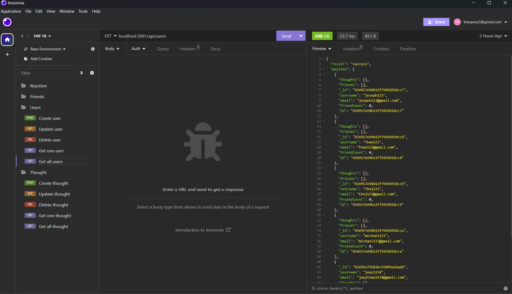

# Social Network API
```
Screencastify video:
https://watch.screencastify.com/v/FQvQf8zn1E1ZoBCrJfZj


Github repo:
https://github.com/Thaodev23/social-network-api
```
## User Story

```
AS A freelance worker for social media
I WANT to make a social network api that uses NoSQL database
SO I can display whatever data I need onto social media

```

## Acceptance Criteria

```
GIVEN I have made an appropriate social network api
WHEN I run the server command 
THEN the appropriate data will be display in MongoDB database
WHEN the server command is run
THEN the API routes are also display in Insomnia
WHEN the routes for DELETE, GET ALL, GET ONE, UPDATE, and CREATE are run
THEN I'm able to delete, create, and update any of the database
```

## Image

Below: Image of the API routes being run. 



## References

Used most of the file structure from Gary Almes'(instructor) inclass MERN demo. The file structure was modified to match the requirement of 
homework 18. 

## Collaborators

```
Jason Yang:
Github profile - https://github.com/Jasony95
Classmate that collaborated on the homework assignment together.
 ```

```
Sichoun Nplhaib Lee:
Github profile - https://github.com/DDXP3.
Classmate that collaborated on the homework assignment together.
```